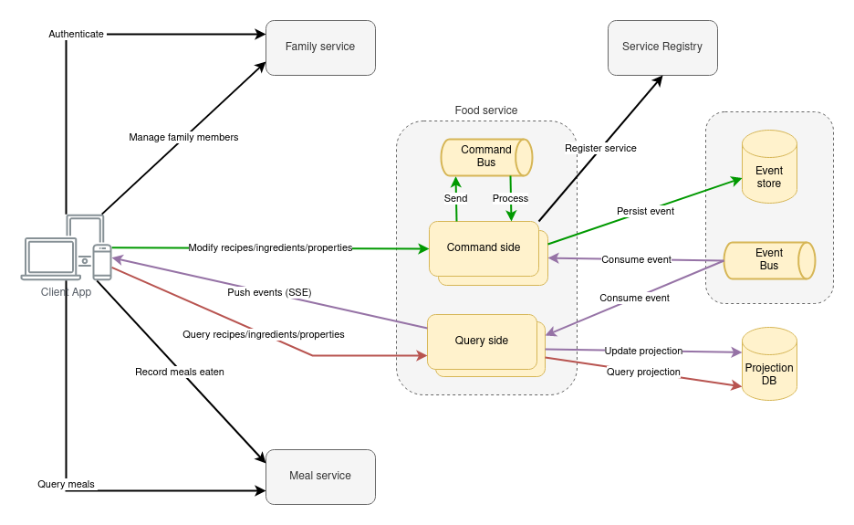

# FOOD SERVICE

Service in charge of managing and querying food entities, part of the Family Recipes application.

## Architecture

### Microservices
- Family service
  - Manage family units, members and permissions
  - Authenticate users
- Food service
  - Manage recipes, ingredients and ingredient properties
  - Query food types
- Meal service
  - Record meals by family members
  - Display meals eaten, stats, reminders

## Next steps
#### Tech
- Move application property secrets from Helm secrets (SOPS) to secrets manager in AWS
- Migrate user journey AT to Cucumber 
- Remove Postgres TOAST OID type
  - https://developer.axoniq.io/w/axonframework-and-postgresql-without-toast
  - https://trifork.nl/blog/axon-postgresql-without-toast/
- Publish DTO and DomainEvents into eus.ibai.family-recipes:food-service-contract artifact so that the Android client or other JVM clients can include them as a dependency
